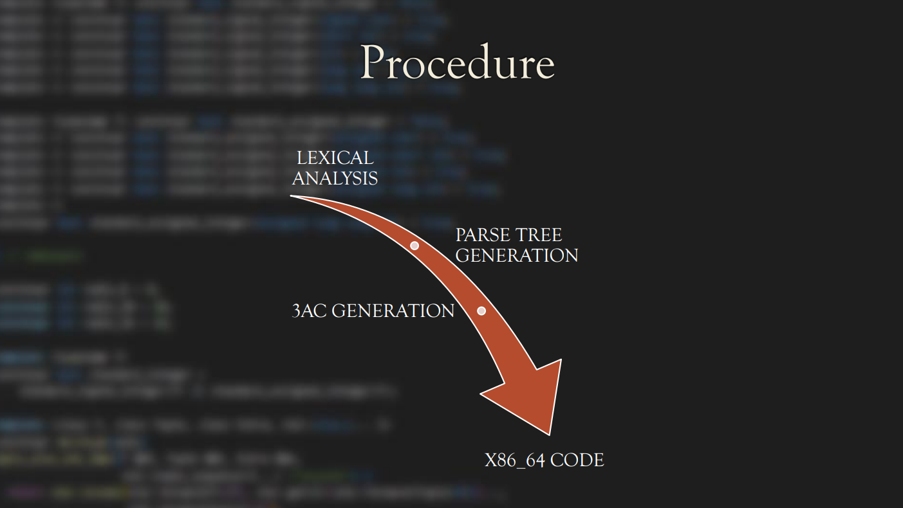

# Compiler Milestone | Course Project CS335 . 
The goal of this project was to implement a compilation toolchain, where the input is in `Java` language
and the output is x86_64 code. And test the correctness and execution of the generated assembly code using the GNU assembler
invoked using as or gcc.

## Instructions to run
1. Go to the src directory. Run the following command to remove previous generated files and compile the required ones:
    ```console
    foo@bar:~$ make clean
    ```
    ```console 
    foo@bar:~$ make
    ```
    `final` is the executable.

2. For the command line executions, write
    ```console 
    foo@bar:~$ ./final −h
    ```
    This will show you all the commands which can be given along with ./final
    ```
    • -i: For getting the input file, as -i=”FileName”
    • -o: For obtaining the output file, as -o=”FileName”
    • -h: will show all the commands and there uses to the user
    • -v: will show the version of the program
    • −−verbose: it will tell, what all has happened through the execution
    of final.
    ```
3. To run the program, use the following command, where Source File is
    `test.java` and the output dot file is `out.dot`
    ```console 
    foo@bar:~$ ./final −i ="test.java" −o="out.dot"
    ```
4. To print the graph, use following command, where the dot file is `out.dot`
    and the graph will be in `graph.ps`
    ```console 
    foo@bar:~$ dot −Tps −o graph . ps out . dot
    ```
5. The symbol table, 3AC dump and the x86 64 assembly code can be found
    in file `SymbolTable.csv, 3ac.txt and out.s` respectively in src directory
6. Running the below command will test the `out.s`
    ```console 
    foo@bar:~$ gcc −no−pie out.s && ./a.out
    ```

## Features Implemented
    - [x] PRIMITIVE  TYPES
    - [x] MULTIDIMENSIONAL ARRAYS (ANY DIMENSION)
    - [x] BASIC  OPERATORS
    - [x] METHOD DECLARATION AND INVOCATION
    - [x] FUNCTIONS, RECURSION AND CONTROL FLOW (IF-ELSE, FOR, WHILE)
    - [x] CLASSES AND OBJECTS
    - [x] SUPPORT FOR PRINTLN

## Procedure


## Example

#### Input.java
```java

public class Example1 {
    int x = 1 + 20/4;
    int y  = x << 2;
    int k = y+1;
    public int setX(int k2){
      this.x = k2;
      return k2;
    }
    Example1(int a, int b) {
        this.x = a;
        this.y = b;
    }
    public int viewX(Example1 pp) {
        return pp.x;
    }

  
    public static void main() {
        int arr[] = new int[10];
        Example1 a = new Example1(29,3);
        Example1 b = new Example1(5, 10);
        int temp = a.setX(1000);
        int c = b.x;
        a.x = 1;
        int d = a.k;
        int m = viewX(a);
        println_m();
    }
  }
  ```
  #### Output
  ```
  1
  ```